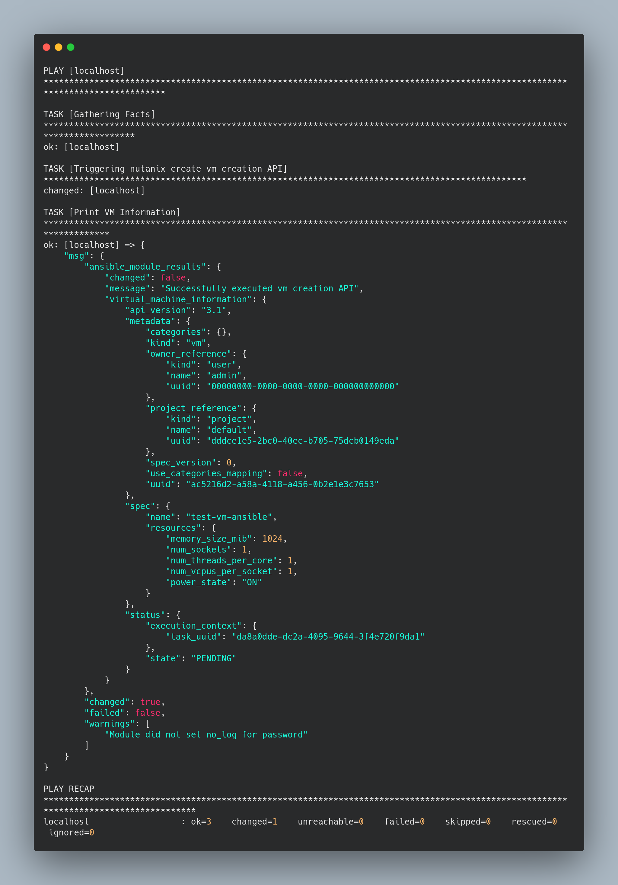

# Nutanix Ansible Plugin

This is a repository which have ansible plugin extension for Nutanix cloud management. Right now this plugin only supports VM management related operations.

To run this playbook, there are few steps which needs to be done:-

```shell
export NUTANIX_USERNAME=Nutanix
export NUTANIX_PASSWORD=Nutanix@312
ansible-playbook playbook.yaml
```

## Output


